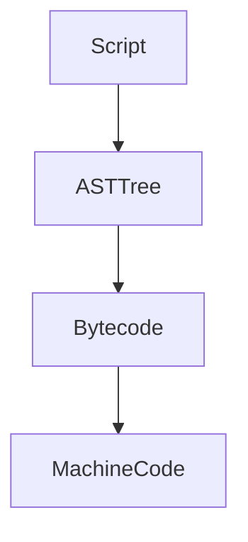

# Fun facts about Javascript
```
 /\_/\  
( o.o ) 
 > ^ <
```
### 00. Javascript can do extension 
An extension is a feature that allows you to add new functionality to an existing class without modifying original class directly. Extensions are a way to extend the behavior and capabilities of types without subclassing. You to add new functionality to an object after the object is created.

```javascript
// class definition
class Person {
  constructor(firstName, lastName) {
    this.firstName = firstName;
    this.lastName = lastName;
  }
}
// creating an instance of Person
let person = new Person('Kenny', 'Lim');

// extending Person type
Person.prototype.fooBar = function() {
  console.log(`Hello, my name is ${this.firstName} ${this.lastName}`);
};

// majik -- person has fooBar method
person.fooBar();
```


### 01. Different ways of defining function
  1. A regular function is hoisted to top level by default, even when the code is the last statement of the file, it will be available everywhere.
  2. In constrast when an arrow function is called before there are defined, it will resolve to an error.
  3. Code inside the arrow function is not compiled until it is being called.
     
```javascript
// creating functions

// with arrow function
const fooBar1 = () => { console.log(`fooBar1`);}

// regular function (hoisted)
function fooBar2() { console.log(`fooBar2`);}
```


### 02. Dot notation and Bracket notation can access/mutate property the same way
You can access/mutate properties in object using both dot notation and bracket notation. Bracket notation is more flexible and allow key to be known at runtime. While dot notation is known before time, more direct and should have slight performance advantage.

```javascript
let person = new Object();

// mutating with dot notation
person.something = 'foo';

// accessing with bracket notation
console.log(person['something']);
```


### 03. Javascript call(...) function reverse the order of calling method
Using Javascript call, we can call a method with function.call(obj, ...) instead of obj.function(...). Various scenarios such as method borrowing & making inheritance possible in Javascript.

```javascript
function greet() {
  console.log(`Hello, ${this.firstName} ${this.lastName}`);
}

const person = { firstName: 'Kenny', lastName: 'Lim' };
// instead of object.method, we are doing method(obj, ...)
greet.call(person);
```


### 04. Javascript call and apply are similar except ...
The apply method is similar to the call method, except that call takes arguments individually, whereas apply takes them as an array. It's useful when you want to invoke a function with a specific context and a variable number of arguments provided in an array-like structure. Making it more dynamic and decide at runtime.

```javascript
function greet(foo) {
  console.log(`${foo}, ${this.firstName} ${this.lastName}`);
}

const person = { firstName: 'Kenny', lastName: 'Lim' };

// using call
greet.call(person, 'foo');

// using apply
greet.apply(person, ['foo']);

```


### 05. Javascript call and bind are similar except ...
The call and bind function are similar. call will run the function, while bind will create the function reference for you to call at a later time.

```javascript
function greet(foo) {
  console.log(`${foo}, ${this.firstName} ${this.lastName}`);
}

const person = { firstName: 'Kenny', lastName: 'Lim' };

// using call
greet.call(person, 'foo');

// using bind
const func = greet.bind(person, 'foo');
func();
```


### 06. Loose equity (==) vs Strict equity
Loose equity will attempt to convert before doing comparison, while strict equity does not convert.

```javascript
// loose equity check
console.log(42 == '42');  // Outputs: true (type coercion: '42' is coerced to number 42)
// strict equity check
console.log(42 === '42');  // Outputs: false (different types)

```


### 07. Proper class inheritance in Javascript
extends keyword is introduced in ES6.

```javascript
class Person {
  constructor(name) {
    this.name = name;
  }
  ...
}

class Student extends Person {
  constructor(name, occupation) {
    super(name);
    this.occupation = occupation;
  }
}
```

### 08. Object deconstructing
Object destructuring allows you to extract properties from an object and assign them to variables in a more concise and convenient way. The name has to match the property name and only need to do assignment on the properties you are interested.

```javascript
const user = {
  name: 'Kenny',
  address: {
    city: 'Klondike',
    postalCode: '98001'
  }
};

const { address: { city, postalCode } } = user;

console.log(city);  
```

### 09. Nobody should use *var*
var is function scoped and can be re-declared many times without throwing any error. The code below looks like it should have compile error but it's ok thanks to var.

```javascript
function foo() {
    if(true) {
        var a = 0; // declare a 1st time
    }
    console.log(a); // accessing a outside of their scope, no problem
    var a = 1;      // declare a 2nd time, no problem
    console.log(a); // we are accessing the correct value
}
foo();
```

### 10. let or const
let and const are block scoped. You must initialize a const value and can't change it. You can have let without initialization and you can reassign the value in let. If you have to reassign the reference in your code, use let. Otherwise, always use const.

```javascript
function foo() {
    const a = 42;
    let b = 43;
    const c = ['a', 'b', 'c'];
    
    a = 44;      // error, can't reassing
    b = 44;      // ok
    c = [];      // error, can't reassing
    c.push('d'); // ok, because you are not changing c.
}
foo();
```
### 11. Object spreading ...
Object spreading is a convenient feature in Javascript to do quick shallow copy or merging values. It makes your code more concise.

```javascript
const obj = { a: 1, b: 2 };
const copy = { ...obj };    // shallow copy

const obj2 = { c: 3, d: 4 };
const merged = { ...obj, ...obj2 }; // merged object
```

### 12. Javascript engine and it's environment
All the Javascript engines out there (V8, SpiderMonkey, JSCore, Chakra) are single threaded. It has a single message loop / queue which is process task one at a time. Environment around Javascript such as Browser or Node.js env have multiple threads. A fetch call is done in i/o thread and when it return, it will callback and put into message loop. This single thread is also known as UI thread or Main thread.

### 13. Higher order functions
Higher order function facilitates functional programming concepts and allow for more modular, concise, flexible, and reusable code. Here are the functions commonly used:

```javascript
const numbers = [1, 2, 3, 4, 5];

// map
const squaredNumbers = numbers.map(num => num * num);       // returns [1, 4, 9, 16, 25]
// filter
const evenNumbers = numbers.filter(num => num % 2 === 0);   // returns [2, 4]
// reduce
const sum = numbers.reduce((acc, num) => acc + num, 0);     // return 15
// forEach
numbers.forEach(num => console.log(num));                   // prints 12345
// sort
const sortedNumbers = numbers.sort((a, b) => b - a);        // returns [5, 4, 3, 2, 1]
// every
const allEven = numbers.every(num => num % 2 === 0);        // return false because not everything is even
// some
const hasEven = numbers.some(num => num % 2 === 0);         // return true because there's at least 1 even number
// find
const result = numbers.find(num => num > 3);                // return 4, first element that match criteria
// flatMap
const arr = [1, 2, [3, 4, 5]];
const flattened = arr.flatMap(num => num);
console.log(flattened)                                      // returns 1, 2, 3, 4, 5. flatten hierarchy.

```


### 14. for loop vs forEach
Considering that we have an array, is it better to use traditional for loop or modern high level forEach? It is better to use traditional for loop because of performance, more control and ability to terminate early.

```javascript
const arr = [1,2,3,4,5];

arr.forEach(e => {     // forEach has overhead of creating closure.
   console.log(e);
});

for (const e of arr) { // more control structure with regular for loop.
  console.log(e);
  if(e === 3) break;   // for loop can exit early, forEach can't.
  if(e === 4) return;  // exit entire function.
}
```

### 15. Script to machine code
Javascript engine can either use Bytecode (interpreted) or Machine Code (compiled) for running program. In general, scripts must be turn into AST tree (abstract syntax tree). It will then turn into bytecode which is good enough for interpreter to run. 

When the engine detect some hot path/segment, it will optimize those path by compiling them into machine code (native). This code will run the fastest. The optimized code is based on some assumptions (such as certain properties always there etc). When the assumption is invalid, de-optimization happens and it will throw away the generated machine code and back to interpreted mode.



fast vs slow mode
single message queue
async await
offline manifest
wait for one, wait for all
web worker
