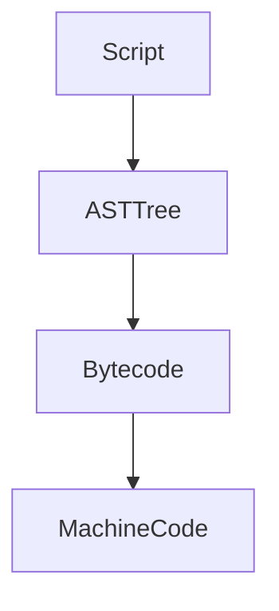
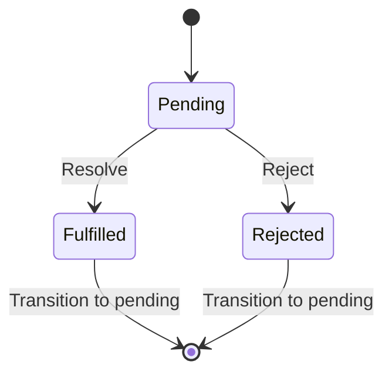

# R@nd0m javascript b1t5
```
 /\_/\  
( o.o ) 
 > ^ <
```
### 00. Javascript can do extension 
An extension is a feature that allows you to add new functionality to an existing class without modifying original class directly. Extensions are a way to extend the behavior and capabilities of types without subclassing. You to add new functionality to an object after the object is created.

```javascript
// class definition
class Person {
  constructor(firstName, lastName) {
    this.firstName = firstName;
    this.lastName = lastName;
  }
}
// creating an instance of Person
let person = new Person('Kenny', 'Lim');

// extending Person type
Person.prototype.fooBar = function() {
  console.log(`Hello, my name is ${this.firstName} ${this.lastName}`);
};

// majik -- person has fooBar method
person.fooBar();
```


### 01. Different ways of defining function
  1. A regular function is hoisted to top level by default, even when the code is the last statement of the file, it will be available everywhere.
  2. In constrast when an arrow function is called before there are defined, it will resolve to an error.
  3. Code inside the arrow function is not compiled until it is being called.
     
```javascript
// creating functions

// with arrow function
const fooBar1 = () => { console.log(`fooBar1`);}

// regular function (hoisted)
function fooBar2() { console.log(`fooBar2`);}
```


### 02. Dot notation and Bracket notation can access/mutate property the same way
You can access/mutate properties in object using both dot notation and bracket notation. Bracket notation is more flexible and allow key to be known at runtime. While dot notation is known before time, more direct and should have slight performance advantage.

```javascript
let person = new Object();

// mutating with dot notation
person.something = 'foo';

// accessing with bracket notation
console.log(person['something']);
```


### 03. Javascript call(...) function reverse the order of calling method
Using Javascript call, we can call a method with function.call(obj, ...) instead of obj.function(...). Various scenarios such as method borrowing & making inheritance possible in Javascript.

```javascript
function greet() {
  console.log(`Hello, ${this.firstName} ${this.lastName}`);
}

const person = { firstName: 'Lenny', lastName: 'Kim' };
// instead of object.method, we are doing method(obj, ...)
greet.call(person);
```


### 04. Javascript call and apply are similar except ...
The apply method is similar to the call method, except that call takes arguments individually, whereas apply takes them as an array. It's useful when you want to invoke a function with a specific context and a variable number of arguments provided in an array-like structure. Making it more dynamic and decide at runtime.

```javascript
function greet(foo) {
  console.log(`${foo}, ${this.firstName} ${this.lastName}`);
}

const person = { firstName: 'Lenny', lastName: 'Kim' };

// using call
greet.call(person, 'foo');

// using apply
greet.apply(person, ['foo']);

```


### 05. Javascript call and bind are similar except ...
The call and bind function are similar. call will run the function, while bind will create the function reference for you to call at a later time.

```javascript
function greet(foo) {
  console.log(`${foo}, ${this.firstName} ${this.lastName}`);
}

const person = { firstName: 'Lenny', lastName: 'Kim' };

// using call
greet.call(person, 'foo');

// using bind
const func = greet.bind(person, 'foo');
func();
```


### 06. Loose equity (==) vs Strict equity
Loose equity will attempt to convert before doing comparison, while strict equity does not convert.

```javascript
// loose equity check
console.log(42 == '42');  // Outputs: true (type coercion: '42' is coerced to number 42)
// strict equity check
console.log(42 === '42');  // Outputs: false (different types)

```

### 07. Inheritance the older way via Prototype
Prototype is a fundamental aspect of how objects and inheritance work in the language. Each JavaScript object has a prototype, which is another object that the current object inherits properties and methods from.

```javascript
// Superclass: Person
function Person(name) {
  this.name = name;
}

Person.prototype.greet = function() {
  console.log('my name is ' + this.name);
};

// Subclass: Student
function Student(name, studentId) {
  // Call the superclass constructor to initialize 'name'
  Person.call(this, name);
  
  // Initialize additional properties specific to Student
  this.studentId = studentId;
}

// Set up inheritance: Student inherits from Person
Student.prototype = Object.create(Person.prototype);
Student.prototype.constructor = Student;

// Additional method for Student
Student.prototype.showId = function() {
  console.log('Student ID:', this.studentId);
};

// Creating instances of Student
const student1 = new Student('Kenny', 'AA123');
const student2 = new Student('Lenny', 'BBB234');

// Using methods from both the Person and Student classes
student1.greet();      
student1.showId();
```

### 08. Proper class inheritance in Javascript
extends keyword is introduced in ES6.

```javascript
class Person {
  constructor(name) {
    this.name = name;
  }
  ...
}

class Student extends Person {
  constructor(name, occupation) {
    super(name);
    this.occupation = occupation;
  }
}
```

### 09. Prototype Chain
When you are calling a method or access a property from an object. If the method or property is not found in the object, it will attempt to search in the prototype object. If that is not available, it will continue to walk up the prototype chain. If nothing is found, it will return **undefined**.

### 10. Object deconstructing
Object destructuring allows you to extract properties from an object and assign them to variables in a more concise and convenient way. The name has to match the property name and only need to do assignment on the properties you are interested.

```javascript
const user = {
  name: 'Kenny',
  address: {
    city: 'Klondike',
    postalCode: '98001'
  }
};

const { address: { city, postalCode } } = user;

console.log(city);  
```

### 11. Nobody should use *var*
var is function scoped and can be re-declared many times without throwing any error. The code below looks like it should have compile error but it's ok thanks to var.

```javascript
function foo() {
    if(true) {
        var a = 0; // declare a 1st time
    }
    console.log(a); // accessing a outside of their scope, no problem
    var a = 1;      // declare a 2nd time, no problem
    console.log(a); // we are accessing the correct value
}
foo();
```

### 12. let or const
let and const are block scoped. You must initialize a const value and can't change it. You can have let without initialization and you can reassign the value in let. If you have to reassign the reference in your code, use let. Otherwise, always use const.

```javascript
function foo() {
    const a = 42;
    let b = 43;
    const c = ['a', 'b', 'c'];
    
    a = 44;      // error, can't reassing
    b = 44;      // ok
    c = [];      // error, can't reassing
    c.push('d'); // ok, because you are not changing c.
}
foo();
```
### 13. Object spreading ...
Object spreading is a convenient feature in Javascript to do quick shallow copy or merging values. It makes your code more concise.

```javascript
const obj = { a: 1, b: 2 };
const copy = { ...obj };    // shallow copy

const obj2 = { c: 3, d: 4 };
const merged = { ...obj, ...obj2 }; // merged object
```

### 14. Javascript engine and it's environment
All the Javascript engines out there are single threaded. It has a single message loop / queue which process one task at a time. Environment around Javascript such as Browser or Node.js env have multiple threads. A fetch call is done in i/o thread and when it return, it will callback and put into message loop. This single thread is also known as UI thread or Main thread. Because it is single threaded, there's no need to do lock for thread synchronization.

### 15. Higher order functions
Higher order function facilitates functional programming concepts and allow for more modular, concise, flexible, and reusable code. Here are the functions commonly used:

```javascript
const numbers = [1, 2, 3, 4, 5];

// map
const squaredNumbers = numbers.map(num => num * num);       // returns [1, 4, 9, 16, 25]
// filter
const evenNumbers = numbers.filter(num => num % 2 === 0);   // returns [2, 4]
// reduce
const sum = numbers.reduce((acc, num) => acc + num, 0);     // return 15
// forEach
numbers.forEach(num => console.log(num));                   // prints 12345
// sort
const sortedNumbers = numbers.sort((a, b) => b - a);        // returns [5, 4, 3, 2, 1]
// every
const allEven = numbers.every(num => num % 2 === 0);        // return false because not everything is even
// some
const hasEven = numbers.some(num => num % 2 === 0);         // return true because there's at least 1 even number
// find
const result = numbers.find(num => num > 3);                // return 4, first element that match criteria
// flatMap
const arr = [1, 2, [3, 4, 5]];
const flattened = arr.flatMap(num => num);
console.log(flattened)                                      // returns 1, 2, 3, 4, 5. flatten hierarchy.

```


### 16. for loop vs forEach
Considering that we have an array, is it better to use traditional for loop or modern high level forEach? It is better to use traditional for loop because of performance, more control and ability to terminate early.

```javascript
const arr = [1,2,3,4,5];

arr.forEach(e => {     // forEach has overhead of creating closure.
   console.log(e);
});

for (const e of arr) { // more control structure with regular for loop.
  console.log(e);
  if(e === 3) break;   // for loop can exit early, forEach can't.
  if(e === 4) return;  // exit entire function.
}
```

### 17. Script to machine code
Javascript engine can either use Bytecode (interpreted) or Machine Code (compiled) for running program. In general, scripts must be turn into AST tree (abstract syntax tree). It will then turn into bytecode which is good enough for interpreter to run. 

When the engine detect some hot path/segment, it will optimize those path by compiling them into machine code (native). This code will run the fastest. The optimized code is based on some assumptions (such as certain properties always there etc). When the assumption is invalid, de-optimization happens and it will throw away the generated machine code and back to interpreted mode.



### 18. {} vs Map for Dictionary functionality
{} has been used as dictionary for a long time due to the lack of Javascript Map support. Map is now available (see code). One should always use Map. The reason being Map is implemented in hashmap while {} is simply regular object in Javascript. Retrieval for Map will be O(1) and {} will be O(n). In Map, order of insertion is preserved.

```javascript
const fakeMap = {
  key1: 'value1',
  key2: 'value2'
};

console.log(fakeMap.key1); 

const realMap = new Map();
realMap.set('key1', 'value1');
realMap.set('key2', 'value2');

console.log(realMap.get('key1'));
```

### 19. Never ever compare a NaN
The NaN value in JavaScript is of the type number. NaN is not equal to itself; hence, comparing NaN to anything, even itself, will result in false.

```javascript
const a = NaN;
console.log(a == NaN)    // false
console.log(a === NaN)   // false, woah
console.log(a === a)     // false, what?!!
```

### 20. Trusting array.length can have side-effect
The implementation of length is a little weird. If we assign to an index directly, the length will be index+1. Javascript never allocate the entire array. So becareful as this can be a very subtle bug that takes a long time to debug.

```javascript
const a = [];
a[10000000] = 5;
console.log(a.length); // returns 10000001
```

### 21. Javascript Promise
Promise allows you to handle asynchronous operations in a more organized and efficient manner. Promise can return resolve for success and reject for failure. While it is waiting, it is in Pending state.

Simple implementation of a function that returns a Promise.
```javascript
function waitForMs(ms)
 return new Promise((resolve, reject) => {
   setTimeout(() => {
     const success = true;
     if (success) {
       resolve('Operation successful');
     } else {
       reject(new Error('Operation failed'));
     }
   }, ms);
 });
}
```
State Machine for a Promise


### 22. Handling Promise that returned
You can use then..catch pattern or async await pattern. Async await pattern makes the code to be more natural to understand as though it is linear & synchronous. Then .. catch pattern looks like callback and using closure. It's really a matter of preference but async await can do more complex stuffs.

```javascript
// using then.catch pattern
waitForMs(200)
  .then((successMessage) => {
    console.log('Success:', successMessage);
  })
  .catch((error) => {
    console.error('Error:', error.message);
  });

// using async await pattern
async function calling() {
  try {
    const result = await waitforMs(200);
    console.log('Success:', result);
  } catch (error) {
    console.error('Error:', error.message);
  }
}
```
### 23. Wait for All Promises
You can use Promise.all(arrayOfPromises) to wait for all promise to resolve. If any promise reject, Promise.all will return immidietely and error. This is a good way to handle task synchronzation.

```javascript
const promise1 = Promise.resolve('Resolved Promise A');
const promise2 = Promise.resolve('Resolved Promise B');
const promise3 = Promise.reject(new Error('Rejected Promise C'));

// this will print 'At least one Promise rejected'
Promise.all([promise1, promise2, promise3])
  .then((values) => {
    console.log('All Promises resolved:', values);
  })
  .catch((error) => {
    console.error('At least one Promise rejected:', error);
  });

// this will print 'All Promises resolved'.
Promise.all([promise1, promise2])
  .then((values) => {
    console.log('All Promises resolved:', values);
  })
  .catch((error) => {
    console.error('At least one Promise rejected:', error);
  });
```

### 24. Wait for first promise to resolve.
There are use cases where we want to get the first promise that resolve, exit and not worry about the other promises.

```javascript
const promises = [
  new Promise((resolve) => setTimeout(() => resolve('Promise A'), 3000)),
  new Promise((resolve) => setTimeout(() => resolve('Promise B'), 1600)),
  new Promise((resolve) => setTimeout(() => resolve('Promise C'), 1500))
];

Promise.race(promises)
  .then((result) => console.log('Promise resolved:', result))
  .catch((error) => console.error('Promise rejected:', error));
```

### 25. What happen when we await Promise(), how does javascript resume.
Javascript is single threaded. When awaiting a promise, Javascript won't run the next line until promise is fulfilled.
When encountering an await statement:

- JavaScript engine registers a continuation to be executed once the awaited Promise settles.
- Once the Promise settles, the registered continuation is added to the Javascript task queue.
- JavaScript event loop checks the Javascript task queue and, if not empty, processes the tasks in the order they were added.
- The registered continuation (the code after the await statement) is executed.

```javascript
console.log('calling await');
await waitForMs(10000);            // wait for 10s but what happen here?
console.log('promise completed');  // will print after 10s
```

### 26. Using additional thread to do work
You are right, Javascript engine is single threaded. The environment around Javascript such as Node.js or browser do support Web Worker API which allows you to create threads and have mechanism to communicate back to Javascript main thread. Web Workers allow you to perform complex calculations, operations, or tasks without blocking the main thread, which can enhance the responsiveness and performance of your web application.

```javascript
// Create a new Web Worker
const worker = new Worker('worker.js');

// Listen for messages from the Web Worker
worker.addEventListener('message', (event) => {
  console.log('Web Worker msg:', event.data);
});

// In worker.js ---------------------------------------

// Listen for messages from the main thread
self.addEventListener('message', (event) => {
  console.log('Received message from main thread:', event.data);

  // Perform some work
  const result = event.data + ' Processed in Web Worker';

  // Send the result back to the main thread
  self.postMessage(result);
});
```

### 27. Can I have many threads?
Yes. Just create as many Worker and listen to them.

```javascript

// Create multiple worker threads
const worker1 = new Worker('worker.js', { workerData: 'Worker 1' });
const worker2 = new Worker('worker.js', { workerData: 'Worker 2' });

// Listen for messages from the worker threads
worker1.on('message', (message) => {
  console.log('Received message from Worker 1:', message);
});

worker2.on('message', (message) => {
  console.log('Received message from Worker 2:', message);
});
```

### 28. Prefer null over undefined
It is common to check for both undefined and null for error. I think setting things to null or initialize to null. Undefined is really something forgotten. If you find any undefined, you should go fix it.

### 29. Accessing GPU (Part 1)
There are various ways to use Javascript to access GPU. The most common scenario is via WebGL. The snippet below is to create a canvas and getting a WebGL surface to render. Here is good [sample webgl](https://github.com/mdn/dom-examples/tree/main/webgl-examples/tutorial/sample8) and here's the [demo](https://mdn.github.io/dom-examples/webgl-examples/tutorial/sample8/).

```javascript
 <canvas id="glcanvas" width="640" height="480"></canvas>
...
const canvas = document.querySelector("#glcanvas");
  // Initialize the GL context
  const gl = canvas.getContext("webgl");

  // Only continue if WebGL is available and working
  if (gl !== null) {

  }
  ...
```

### 30. Accessing GPU (Part 2)
You can use tensorflow.js and similar API for ML task. Though this is more specialized. For general purpose, we can access WebGPU from Javascript. Sample [here](https://mdn.github.io/dom-examples/webgpu-compute-demo/script.js). Just like any work sent to GPU, it is commonly done in a shader. Another GPGPU library is [gpu.js](https://gpu.rocks/#/).

```javascript
// Compute shader
const shader = `
@group(0) @binding(0)
var<storage, read_write> output: array<f32>;

@compute @workgroup_size(64)
fn main(
  @builtin(global_invocation_id)
  global_id : vec3u,

  @builtin(local_invocation_id)
  local_id : vec3u,
) {
  // Avoid accessing the buffer out of bounds
  if (global_id.x >= ${BUFFER_SIZE}u) {
    return;
  }

  output[global_id.x] =
    f32(global_id.x) * 1000. + f32(local_id.x);
}
`;
```

### 31. What are all the Javascript engine?
- V8 - by far the most common Javascript engine. This is used in Chrome browser and Node.js runtime.
- SpiderMonkey - this is Javascript engine from Mozilla / Firefox.
- JavascriptCore - this one from Apple, used in Safari browser. Ever wonder why RN app is not consistant across Android & iOS? This is the reason.
- Chakra - this one is from Microsoft.
- MuJS / Duktape / Moddable XS / JerryScript - small embedded & iot devices.

### 32. Can Javascript leak memory?
Yes.

```javascript
function outerFunction() {
  const outer_data = new Array(999999).fill('xxxx xxxx');

  function innerFunction() {
    console.log(outer_data.slice(0, 1)); // using outer_data
  }

  return innerFunction;
}

let leakedClosure = outerFunction();
```

The above code will leak memory because innerFunction is holding to outer_data. To fix this, set leakedClosure to null.

```javascript
leakedClosure = null;
```

There are many other ways to leak memory in Javascript:
- Circular reference (A -> B -> A)
- Setting global variable to external like window object.
- Any map / array in global will hold everything in memory.
- Event handler as a closure.
- Timer without clear timer.

### 33. WeakMap / WeakSet
WeakMap provides a way to create a collection of key-value pairs where the keys are weakly referenced. In other words, entries in a WeakMap do not prevent the keys from being garbage-collected when there are no other references to them.

```javascript
const weakMap = new WeakMap();

// Create an object to use as a key
const keyObject = {};

// Add a key-value pair to the WeakMap
weakMap.set(keyObject, 'Value associated with keyObject');

// Retrieve the value associated with the keyObject
console.log(weakMap.get(keyObject)); // Output: Value associated with keyObject

// Remove the reference to the keyObject
keyObject = null;

// At this point, the keyObject is no longer needed, and it becomes eligible for garbage collection.
// The associated entry in the WeakMap will also be removed automatically.
```

### 34. Can Javascript handle binary?
Yes. Mainly using **Buffer** class. See examples below"

```javascript
const byteArray = [0x48, 0x65, 0x6C, 0x6C, 0x6F]; // ASCII codes for 'Hello'
const bufferFromByteArray = Buffer.from(byteArray);

console.log('Buffer from byte array:', bufferFromByteArray);
```

### 35. Javascript Binding for C++ library
The way it has been is library developer write code in C++ and use tool like **node-gyp** build and bind into Node using addon API. This is changing. The modern way to do this is via WebAssembly [More info here](https://developer.mozilla.org/en-US/docs/WebAssembly). You can use any language (C/C++, C#, Python, Go, Rust, Java & Kotlin )to write wasm and create as a wasm module.

```javascript
// my-asm.js is created with 'emcc native_code.cpp -o my-asm.js'
// Load the WebAssembly module
const Module = require('./my-asm.js');

Module.onRuntimeInitialized = function() {
  console.log('WebAssembly module loaded');
  console.log('Result:', Module.foobar());
};
```

### 36. What is Javascript bridge
Javascript bridge is a mechanism where Javascript code (normally in a webview) can communicate 2-way with their host (iOS native, Android native, Flutter). This is very common in Mobile development and it's very common to have a webview within the application.

```javascript
// iOS
function callNative() {
    window.webkit.messageHandlers.iOS.postMessage("Hello from JavaScript!");
}
// Flutter
function sendMessageToFlutter() {
  const message = { type: 'FROM_WEBVIEW', data: 'Hello, Flutter!' };
  window.postMessage(JSON.stringify(message));
}
```

### 37. 'this' reference in Javascript
'this' in Javascript is referring to context and scope. Let's illustrate with code:

```javascript
// use1: adding property / method
function Person(name) {
  this.name = name;      // <- add property
  this.sayHi = () => {}  // <- add arrow function
}

const person = new Person('Lenny');
console.log(person.name);

// use2: accessing property using this
const obj = {
  prop: 'Hello',
  greet: function() {
    console.log(this.prop);  // <-- accessing the object's property using this
  }
};

// this in event handling
const button = document.getElementById('button');
button.addEventListener('click', function() {
  console.log(this);  // <-- Refers to the button element
});
```

### 38. Javascript statement doesn't need ; close anymore.
This is good to know but it really doesn't matter to me. I think it depends on your codebase. Just be consistent with it.

### 39. SharedArrayBuffer
When passing data between web workers and main, data has to be serialized, deserialized and copy. This is inefficient especially for ML related work. SharedArrayBuffer is introduced and now you can share buffer across different contexts.

```javascript
const buffer = new SharedArrayBuffer(16);

// create worker and pass buffer reference to it
const worker = new Worker('worker.js');
worker.postMessage({ buffer });

// worker.js
onmessage = (event) => {
  const { buffer } = event.data;
  const int32Array = new Int32Array(buffer);

  // Access and manipulate the shared buffer
  int32Array[0] = 33;
};
```

### 40. XXXL number. BigInt
Javascript now support BigInt which can go larger than 2^53 - 1 (limit for number).

```javascript
const bigIntA = 1234567890123456789012345678901234567890n;
const bigIntB = BigInt('987654321098765432109876543210');

const sum = bigIntA + bigIntB;
const product = bigIntA * bigIntB;

console.log('Sum:', sum);         // Outputs: Sum: 1234567890123456789999999999999999990100n
console.log('Product:', product); // Outputs: Product: 1219326311126352697579906220182235292041254607981000n
```

### 41. Nullish Coalescing Operator (??) 
?? is used to set default value if the variable is either null or undefined. Developers have been using || to set default value and that is different from ??. 
- ?? will set default value if value is null or undefined
- || will set default value if lhs is false. For eg. const defaultValue = '' || 'default'; // will always set to 'default'.

```javascript
const userInput = null; // This could be null or undefined

// Using ?? to provide a default value
const defaultValue = userInput ?? 'default';

console.log(defaultValue); // Outputs: default
```

### 38. Offline manifest

### 39. Service Worker
