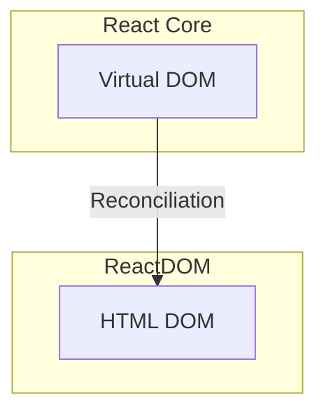
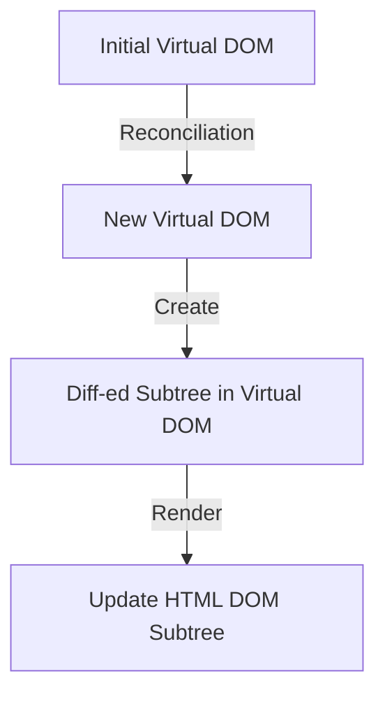
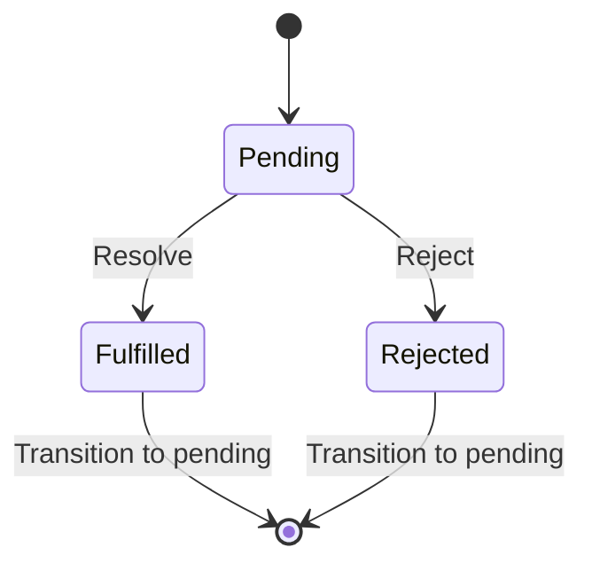

## R𝒶𝓃𝒹ℴ𝓂 REACT 𝒷𝒾𝓉𝓈
```
 /\_/\  
( o.o ) 
 > ^ <
```
### 00. Use functional component
`Functional component` was introduced in React 16.8. It is the preferred way to write React component (as opposed to older class component). 
It is more maintainable, modern and concise. Plus you can leverage `React Hooks` which makes it easier to manage states and instead of dealing lifecycle, it uses state (data flow). 
All the new effort is focus in functional ways so `class component` will be slowly deprecated. 

### 01. Bootstrapping with ReactDOM
In React, one of the initial APIs you'll come across is `ReactDOM`, which plays a key role in rendering your application. ReactDOM provides two main methods: render for client-side rendering and hydrate for handling server-side rendered content. These APIs facilitate the initial rendering and the subsequent reconciliation process in your React application.

The render method is used for the initial rendering of your React application on the client side. It establishes the connection between a specific HTML DOM element, designated as the root, and the root node of your React application.

The hydrate method, on the other hand, is employed when dealing with server-side rendered content. It serves to attach event listeners and establish interactivity within the existing HTML structure, thus enabling the hydration of your React application.

Both of these methods are fundamental to the rendering process in React, allowing your application to efficiently bridge the Virtual DOM with the actual HTML DOM.
```javascript
const root = ReactDOM.createRoot(document.getElementById('root'));
root.render( <App /> );
```

Relationship between ReactDOM and Virtual DOM


### 02. Virtual DOM
The `Virtual DOM`, a key concept in React, serves as a lightweight, in-memory mirror of the actual Document Object Model (DOM) and the current state of your user interface. It's represented as JavaScript objects, and React leverages it for performance optimization.

React employs the Virtual DOM to enhance updates by employing a process called "diffing." It calculates the disparities between the new Virtual DOM tree and the one generated during the previous render. This method is commonly referred to as "reconciliation."

This approach is designed to be efficient. It targets and applies changes only to the portions of the Virtual DOM tree that differ from the previous version, minimizing interactions with the real HTML DOM. This is essential for improving performance since direct manipulation of the HTML DOM can be sluggish and resource-intensive.
It calculates the differences between these two virtual representations. This process is known as "reconciliation."



### 03. JSX
JSX is a convenient syntax for defining the structure and content of your React components. It's transpiled (at build time) into JavaScript code that creates React elements, which are then rendered into the HTML DOM to display your user interface.

- `const element = <h2>Hello, Lenny!</h2>;  // JSX` to
- `const element = React.createElement("h2", null, "Hello, Lenny!");  // Javascript` to
- `ReactDOM.render(element, document.getElementById("root"));   // React render` to
- `<body id='root'><h2>Hello, Lenny!</h2></body>` (HTML tree)

In this example, it may not seem like JSX provides a significant advantage. In practical scenarios, you can create self-contained components, like a "Wallet," with their own HTML structure and behavior, which can be easily reused throughout your application. In standard HTML, this level of encapsulation isn't readily achievable. To attain such encapsulation, you would need to utilize "shadow DOM," a relatively recent feature. While conceptually similar to JSX, there's a notable distinction: shadow DOM operates directly on the real DOM, whereas JSX serves as a logical construct that interfaces with the Virtual DOM, residing in JavaScript memory.

The key takeaway here is that shadow DOM enables you to create reusable and encapsulated components that are conceptually akin to those constructed with JSX but have a direct impact on the actual Document Object Model, offering a new level of modularity and isolation.

### 04. React tools
These are some must have tools for React.

- [Glean for JSX refactoring](https://marketplace.visualstudio.com/items?itemName=wix.glean)
- [React Dev Tools](https://chrome.google.com/webstore/detail/react-developer-tools/fmkadmapgofadopljbjfkapdkoienihi)
- [Prettier](https://prettier.io/)
- [VS Code](https://code.visualstudio.com/)

### 05. Show Update Highlights
One of the tool that we use to show render update is in React Dev Tools. Go into Chrome dev tools (Cmd, Option+i) and go to Components tab.

Next to the search box, click on the `settings` icon.
Click on the " Highlight updates when components render" checkbox.

This tool is invaluable to show when your React application does unneccessary updates which is bad for performance.

### 06. React StrictMode
You may have seen the following code. This code enables `StrictMode` for React development.

```javascript
  <React.StrictMode>
    <App />
  </React.StrictMode>
```

Why do we need StrictMode?

- Warn us about bad practices in React development such as making a network call duing render
- Detecting duplicate render cycles
- Detecting inconsistent update
- Deprecated API usage

StrictMode does double invocation. It helps identify issues like unintentional side effects in the render phase or components that may rely on a specific rendering order. This is only during development.
It's important to understand that this behavior is only seen in the development environment when React Strict Mode is enabled. In a production environment, this double invocation doesn't occur, and your components behave as expected.

### 07. React Router
`React router` handles routing and navigation in React applications. It enables you to create single-page applications (SPAs) with dynamic URLs, allowing you to define different components for different routes without the need for full-page reload. In this code example, `/wallet` will result in the rendering of `<Wallet/>` component. Whenever the `path` doesn't match to any known paths, it will send to the default which is `<NotFound/>` in this example. React router supports HTML5 history API which means 
back and forward are automatically handled.

```javascript
function App() {
  return (
    <Router>
      <div>
        <Switch>
          <Route path="/info"><Info /></Route>
          <Route path="/wallet"><Wallet /></Route>
          <Route><NotFound /></Route>
        </Switch>
      </div>
    </Router>
  );
}
```

### 08. Error Boundary
Error boundaries in React are a powerful feature that allows you to gracefully handle and display errors that occur within the component tree.
Think of it like a `try .. catch .. finally` block, if error occurred within the subtree, an error UI will display and do whatever logging to ensure
developer gets notified in development or production.

To use `ErrorBoundary`:
```javascript
<ErrorBoundary>
   <FeatureComponentSubTree />
</ErrorBoundary>
```

It is important for developers to implement their own error boundaries because error handling can be highly application-specific. 
```javascript
export const ErrorBoundary = ({ children }) => {
  const errorEvent = 'Error';
  const [isError, setIsError] = useState(false);

  useEffect(() => {
    const errorHandler = (error) => {
      console.error(error);
      setIsError(true);
    };

    window.addEventListener(errorEvent, errorHandler);

    return () => {
      window.removeEventListener(errorEvent, errorHandler);
    };
  }, []);

  if (isError) {
    return <GenericError/>;
  }
  return children;
}
```

### 09. React Lazy & Code Splitting
`Dynamic import` in JavaScript is a feature introduced in `ES11` that allows you to import modules or code dynamically, at runtime, rather than at the top level of a module. This is especially useful for lazy-loading modules and improving the performance of your web applications by only loading code when it's actually needed, rather than all at once. 

```javascript
import React, { lazy } from 'react';

const lazyObject = lazy(() => import('./LazyComponent'));
```
React leverages the `ES11 dynamic import` feature to implement React lazy loading. In the following example, the 'lazyObject' module is neither compiled nor downloaded during the application's initial load; instead, it is deferred until it's invoked later in runtime, typically when you use `<lazyObject/>`.

This technique synergizes effectively with code splitting, a common practice during React builds with tools like Webpack. With code splitting, all the code associated with 'LazyComponent' is packaged and minified into a separate bundle. Only when you eventually invoke `<lazyObject/>`, it triggers the download, parse and compilation of 'lazyObject' at that point in time, optimizing the application's loading performance.

### 10. Suspense and fallback
`Suspense` and `fallback` are concepts introduced in React to handle asynchronous operations, such as code splitting and data fetching. The `lazyObject` above is one example that we can leverage 
Suspense and fallback:

```javascript
import React, { lazy, Suspense } from 'react';

const lazyObject = lazy(() => import('./LazyComponent'));

function App() {
  return (
    <div>
      <Suspense fallback={<div>Loading...</div>}>
        <lazyObject />
      </Suspense>
    </div>
  );
}
```
In the code above, while lazyObject is not ready, it will show `loading...` until the component is ready for render. 

Suspense work with Promises (Javascript). Promise has 3 states: `pending`, `fulfilled` & `rejected`. It will use fallback component when it is `pending`. It will show the `lazyObject` when it is `fulfilled` and it will show error if there's an Error boundary defined and state is `rejected`. Although this example shows lazy import of component, other use cases like animation loading and data fetching can also use this pattern.

State Machine for a Promise


### 11. React Fragment
Before the introduction of `React Fragments`, when you had multiple sibling components like `<Component1/><Component2/><Component3/>`, React required that you return a single root node from a functional component. To work around this limitation, developers often used a `<div>` as a wrapping root element. However, this approach came with downsides such as bloated hierarchy, longer tree construction times, event propagation complexity, and increased property inheritance costs in the HTML DOM.

```javascript
// before
<div>
  <Component1/>
  <Component2/>
  <Component3/>
</div>

// after: with fragment
<>
  <Component1/>
  <Component2/>
  <Component3/>
</>

```
React Fragments provide a solution to this issue. They allow you to group and return multiple adjacent elements without affecting the HTML DOM structure. Essentially, a React Fragment is a lightweight and invisible container that doesn't introduce additional elements to the DOM. This feature ensures cleaner and more efficient code, particularly when rendering lists of components or handling adjacent elements.

### 12. ThemeProvider
`ThemeProvider` allows you to define and manage a theme or set of design variables (e.g., colors, typography, spacing) and make them available to your components throughout your application. It 
also allows theme to be change at runtime (eg. from light theme to dark theme) and all components update in a flash. It is normal to have `ThemeProvider` close to the root of your Application.

```javascript
const theme = {
  colors: {
    primary: 'red',
    secondary: 'pink',
  },
};

const blueTheme = {
  colors: {
    primary: 'blue',
    secondary: 'cyan',
  },
};


const MyButton = styled.button`
  background-color: ${props => props.theme.colors.primary};
  color: ${props => props.theme.colors.secondary};
  padding: 10px 20px;
`;

<ThemeProvider theme={theme}>
  <MyButton /> <!-- can be a subtree of components -->
</ThemeProvider>

// code can call setTheme(blueTheme) and theme will change.
```

### 13. Functional & class component mapping
While we know we should be using functional component, it is good to know how to map the lifecycle of class component over to functional component:

- componentDidMount
```javascript
useEffect(() => {
  // code (runs after the initial render)
}, []);
```
- componentDidUpdate
```javascript
useEffect(() => {
  // code (runs when specified dependencies change)
}, [propA, propB]);
```
- componentWillUnmount
```javascript
useEffect(() => {
  return () => {
    // clean up code  (runs when the component unmounts)
  };
}, []);
```
- shouldComponentUpdate
```javascript
const MyComponent = React.memo(({ prop1, prop2 }) => {
  // Your component logic
});

const memoizedValue = useMemo(() => computeExpensiveValue(prop), [prop]);
```

### 14. React Rendering (SSR or CSR)
In the early web days, everything is rendered on the server and sent down to the browser as HTML format. I call this `pure SSR` and should not be confused with React `SSR`.

React CSR is client side rendering. This is when react bundle is being downloaded (typically from CDN) and being rendered on the client.
- A root empty HTML page is loaded from CDN. This will bring in React bundle andReact takes over the rendering process on the client side.
- Data Fetching: After the initial page is hydrated, you can use JavaScript to fetch data from APIs or other sources. Data fetching can be triggered in response to user interactions, like button clicks or route changes.

React SSR is server side rendering. This should really be `hybrid rendering`. This is the typical case:
- Initial Server-Side Rendering (SSR): When a user first loads the page, the server performs the initial rendering of the React components and sends HTML to the client with the data available at that point. The initial data can be obtained by fetching from an API or other sources on the server before rendering.
- Client-Side React Hydration: After the initial HTML page is loaded in the browser, the JavaScript code for your React application is executed, and the client-side hydration process occurs. React on the client side takes over and recognizes the existing HTML structure, reattaches event handlers, and brings the page to an interactive state.
- Subsequent Data Fetching: Once the initial page is loaded and the React components are hydrated, you can use client-side JavaScript to make subsequent API calls as the user interacts with the application. These subsequent API calls can be triggered by user actions, such as button clicks or route changes.

React SSR normally get you better SEO support, requires servers to be setup. While CSR can be cheaply setup to all point to CDN without any server host.

### 15. useState
`useState` is a fundamental React hook that enables you to incorporate and manage state variables within your functional components. The following example illustrates the basic usage of useState with a primitive data type. You can utilize `count` as an accessor and `setCount` as a mutator.

```javascript
// dealing with primitive type
const [count, setCount] = useState(0);
..
return(<>
<p>Count: {count}</p>
<button onClick={() => setCount(count + 1)}>+</button>
</>);
```

### 16. useState with Object
You can use useState for object as well. Imagine this code. You can reference to the property of object for rendering. However, please note that we need to create a new object whenever we setUser.
When updating state variables that are objects or arrays, it's important to create a new object or array to trigger a re-render. React relies on shallow comparison to determine if state has changed.
This means `name` and `id` is always coupled together in the rendering cycle.

```javascript
const [user, setUser] = useState({ name: 'Lenny', id: 8 });
...
<p>Name: {user.name}</p>
<p>Id: {user.id}</p>

<button onClick={() => setUser({ ...user, id: user.id + 1 })}>+</button>
```

```javascript
let obj = { name: 'Lenny', id: 8 }
const [user, setUser] = useState(obj);
...
<p>Name: {user.name}</p>
<p>Id: {user.id}</p>

// this will not trigger re-render !!!
<button onClick={() => { obj.name = 'Kenny'; setUser(obj) }}>+</button>
```

The above code will never trigger re-render when `button` is clicked. This is because the setUser(obj) is setting the same object reference, thereby no change detected.

The three takeaway is React uses shallow comparison for object, you need to create a new object to trigger change & new object will change for all properties inside it.

### 17. React Batch Update
If you call this code:
```javascript
<button onClick={() => {
 setCount(count + 1);
 setCount(count + 1);
 setCount(count + 1);
}}>+</button>
```
you might not get the expected result because React batches state updates. React is designed to optimize state updates for performance, and it might batch multiple setState calls into a single update. This means `count` is not updated synchronously and after all this event, `count === 1`. If you have to call multiple times, should use the functional update form of setState like:
```javascript
<button onClick={() => {
 setCount((prev) => prev + 1);
 setCount((prev) => prev + 1);
 setCount((prev) => prev + 1);
// count will be 3
}}>+</button>
```

### 18. useState as global state
No. Using `useState` as global state management is bad for performance, code maintenance since it needs to be passed into props every where. Stick to using useState in local component.

For global state, use other state management library.

### 19. useContext
`useContext` is a powerful tool for managing and sharing global or shared state and functionality across components in your application. The sharing of data is define at Provider level and can be used without passing through props. This is designed to be a simple global state management API. Here's the code example:

```javascript
import React, { createContext, useContext, useState } from 'react';

// Step 1: Create a context
const MyContext = createContext();

// Step 2: Create a component that provides the context
function ContextProvider({ children }) {
  const [count, setCount] = useState(0);

  const increment = () => {
    setCount(count + 1);
  };

  return (
    <MyContext.Provider value={{ count, increment }}>
      {children}
    </MyContext.Provider>
  );
}

// Step 3: Create a component that consumes the context
function Counter() {
  const { count, increment } = useContext(MyContext);

  return (
    <div>
      <p>Count: {count}</p>
      <button onClick={increment}>Increment</button>
    </div>
  );
}

// Step 4: Wrap the application with the context provider
function App() {
  return (
    <ContextProvider>
      <Counter />
    </ContextProvider>
  );
}
```

The ContextProvider still exhibits some outstanding issues. Consider a scenario where your application receives diverse data types that necessitate multiple layers of Providers. This can become challenging to handle. However, for straightforward global state management, useContext stands out as the optimal choice.
