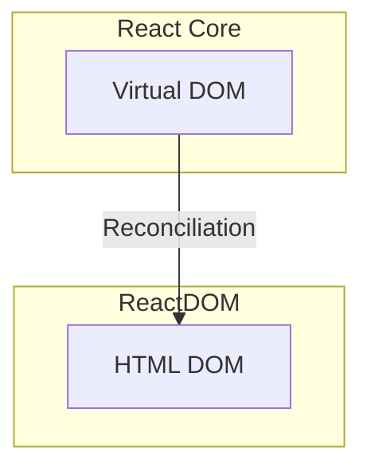

## R𝒶𝓃𝒹ℴ𝓂 REACT 𝒷𝒾𝓉𝓈
```
 /\_/\  
( o.o ) 
 > ^ <
```
### 00. Use functional component
`Functional component` was introduced in React 16.8. It is the preferred way to write React component (as opposed to older class component). 
It is more maintainable, modern and concise. Plus you can leverage `React Hooks` which makes it easier to manage states and instead of dealing lifecycle, it uses state (data flow). 
All the new effort is focus in functional ways so `class component` will be slowly deprecated. 

### 01. Bootstrapping with ReactDOM
In React, one of the initial APIs you'll come across is `ReactDOM`, which plays a key role in rendering your application. ReactDOM provides two main methods: render for client-side rendering and hydrate for handling server-side rendered content. These APIs facilitate the initial rendering and the subsequent reconciliation process in your React application.

The render method is used for the initial rendering of your React application on the client side. It establishes the connection between a specific HTML DOM element, designated as the root, and the root node of your React application.

The hydrate method, on the other hand, is employed when dealing with server-side rendered content. It serves to attach event listeners and establish interactivity within the existing HTML structure, thus enabling the hydration of your React application.

Both of these methods are fundamental to the rendering process in React, allowing your application to efficiently bridge the Virtual DOM with the actual HTML DOM.
```javascript
const root = ReactDOM.createRoot(document.getElementById('root'));
root.render( <App /> );
```

Relationship between ReactDOM and Virtual DOM


### 02. Virtual DOM
The `Virtual DOM`, a key concept in React, serves as a lightweight, in-memory mirror of the actual Document Object Model (DOM) and the current state of your user interface. It's represented as JavaScript objects, and React leverages it for performance optimization.

React employs the Virtual DOM to enhance updates by employing a process called "diffing." It calculates the disparities between the new Virtual DOM tree and the one generated during the previous render. This method is commonly referred to as "reconciliation."

This approach is designed to be efficient. It targets and applies changes only to the portions of the Virtual DOM tree that differ from the previous version, minimizing interactions with the real HTML DOM. This is essential for improving performance since direct manipulation of the HTML DOM can be sluggish and resource-intensive.
It calculates the differences between these two virtual representations. This process is known as "reconciliation."

### 03. JSX
JSX is a convenient syntax for defining the structure and content of your React components. It's transpiled (at build time) into JavaScript code that creates React elements, which are then rendered into the HTML DOM to display your user interface.

- `const element = <h2>Hello, Lenny!</h2>;  // JSX` to
- `const element = React.createElement("h2", null, "Hello, Lenny!");  // Javascript` to
- `ReactDOM.render(element, document.getElementById("root"));   // React render` to
- `<body id='root'><h2>Hello, Lenny!</h2></body>` (HTML tree)

In this example, it may not seem like JSX provides a significant advantage. In practical scenarios, you can create self-contained components, like a "Wallet," with their own HTML structure and behavior, which can be easily reused throughout your application. In standard HTML, this level of encapsulation isn't readily achievable. To attain such encapsulation, you would need to utilize "shadow DOM," a relatively recent feature. While conceptually similar to JSX, there's a notable distinction: shadow DOM operates directly on the real DOM, whereas JSX serves as a logical construct that interfaces with the Virtual DOM, residing in JavaScript memory.

The key takeaway here is that shadow DOM enables you to create reusable and encapsulated components that are conceptually akin to those constructed with JSX but have a direct impact on the actual Document Object Model, offering a new level of modularity and isolation.

### 04. React tools
These are some must have tools for React.

- [Glean for JSX refactoring](https://marketplace.visualstudio.com/items?itemName=wix.glean)
- [React Dev Tools](https://chrome.google.com/webstore/detail/react-developer-tools/fmkadmapgofadopljbjfkapdkoienihi)
- [Prettier](https://prettier.io/)
- [VS Code](https://code.visualstudio.com/)

### 05. Update Highlights
One of the tool that we use to show render update is in React Dev Tools. Go into Chrome dev tools (Cmd, Shift+i) and go to React tab.

Click on the "Updates" tab.
Click on the "Show update indicator" checkbox.

### 06. React StrictMode
You may have seen the following code. This code enables `StrictMode` for React development.

```javascript
  <React.StrictMode>
    <App />
  </React.StrictMode>
```

Why do we need StrictMode?

- Warn us about bad practices in React development such as making a network call duing render
- Detecting duplicate render cycles
- Detecting inconsistent update
- Deprecated API usage

StrictMode does double invocation. It helps identify issues like unintentional side effects in the render phase or components that may rely on a specific rendering order. This is only during development.
It's important to understand that this behavior is only seen in the development environment when React Strict Mode is enabled. In a production environment, this double invocation doesn't occur, and your components behave as expected.

